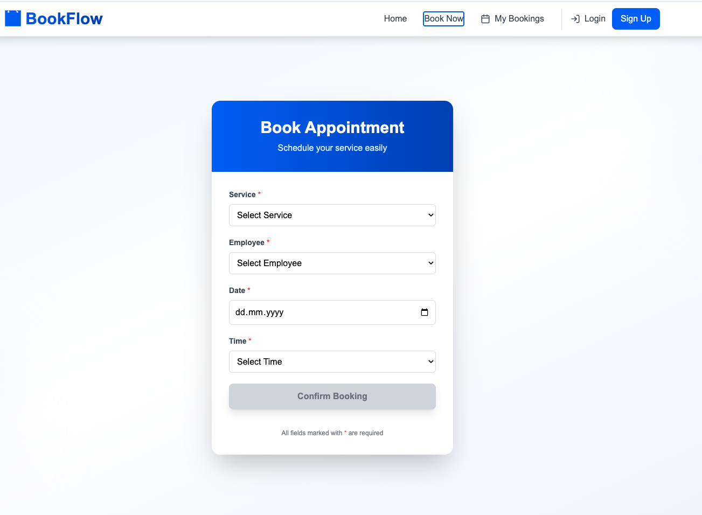
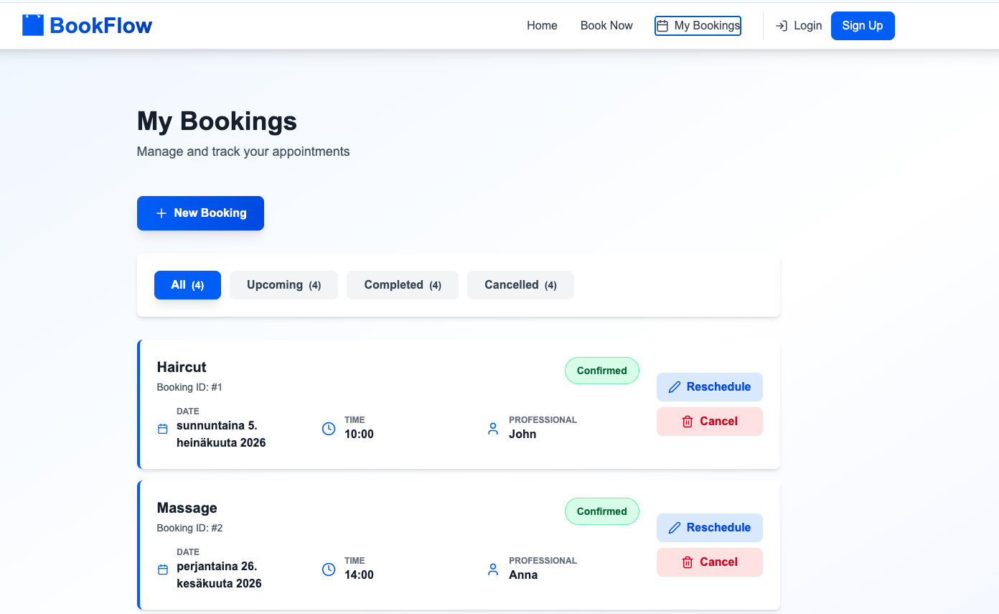

# 🚀 BookFlow – Appointment Booking System (SaaS Demo)

## 🌐 Live Demo
https://bookflowui.netlify.app/

---

## 📌 Overview

BookFlow is a modern appointment booking system designed for small and medium-sized service businesses such as salons, clinics, consultants, and repair services.

It replaces manual booking methods (phone calls, WhatsApp, spreadsheets) with a fully automated online scheduling system.

The goal is to improve efficiency, reduce booking errors, and enhance customer experience.

---

## 🎯 Problem It Solves

Many small businesses still manage appointments manually, leading to:

- Double bookings
- Missed appointments
- Poor scheduling visibility
- High administrative workload
- Lost customers due to slow response times

---

## 💡 Solution

BookFlow centralizes the entire booking workflow into a single web platform:

- Online appointment booking
- Real-time scheduling
- Service & staff management
- Customer tracking
- Admin dashboard for full control

---

## ⚙️ Core Features

### 🧑‍💼 Customer Side
- Browse available services
- View pricing & duration
- Select staff member
- Choose date & time slot
- Instant booking confirmation

### 🛠 Admin Dashboard
- Manage appointments (create, edit, cancel)
- Manage services and pricing
- Manage employees and availability
- View customer booking history
- Overview dashboard with key metrics

---

## 🔐 Authentication & Roles

- JWT-based authentication
- Role-based access control:
  - Admin
  - Employee
  - Customer (optional)

---

## 📅 Booking System Features

- Prevents double bookings
- Validates availability
- Supports service duration logic
- Generates unique appointment records

---

## 🧱 Tech Stack

### Frontend
- React (Vite)
- TypeScript
- React Router
- TailwindCSS (optional styling)

### Backend
- Node.js
- Express.js
- Prisma ORM

### Database
- PostgreSQL

### Authentication
- JWT
- Bcrypt

### Deployment
- Frontend: Netlify
- Backend: Railway / Render
- Database: Supabase PostgreSQL

---

## 🏗 Architecture

Frontend (React)
→ REST API (Express)
→ Database (PostgreSQL)
→ Email Service (Nodemailer)

---

## 📊 Business Value

This system helps service businesses:

- Save 5–10 hours/week in admin work
- Reduce scheduling errors by 30%+
- Improve customer booking experience
- Increase operational efficiency

---

## 📱 Screens Included (Portfolio)

- Home Page
- Service Selection UI
- Booking Flow
- Confirmation Screen
- Admin Dashboard
- Customer Management
- Service Management
- Employee Scheduling
- Mobile Responsive View

---

## 🚀 Future Enhancements

- SMS & Email reminders
- Google Calendar integration
- Online payments (Stripe)
- Multi-location support
- Analytics dashboard
- Customer reviews system

---

## 👨‍💻 Project Status

✔ Production-ready portfolio project  
✔ Fully functional frontend + backend architecture  
✔ Scalable SaaS foundation  

---

## 👤 Author

Daniyal Tariq
Web Apps Developer for Finnish SMEs | React | Node.js | SaaS Systems
