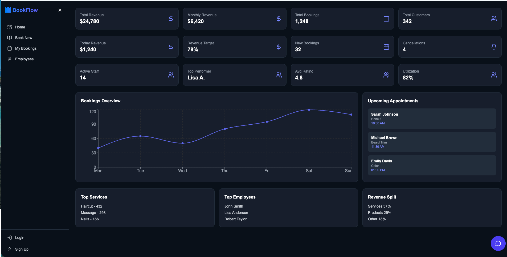
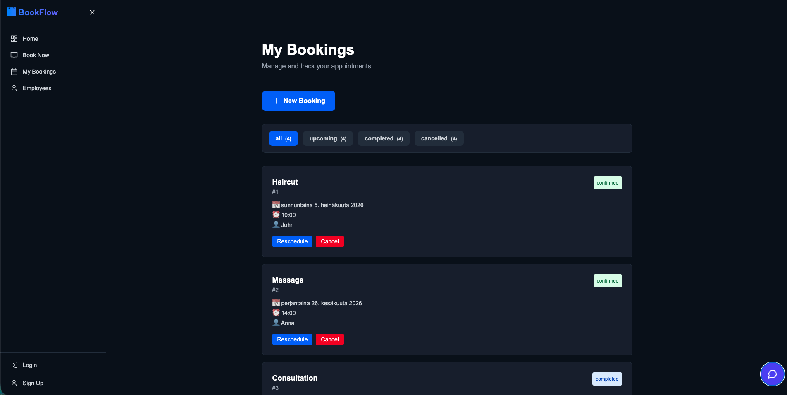
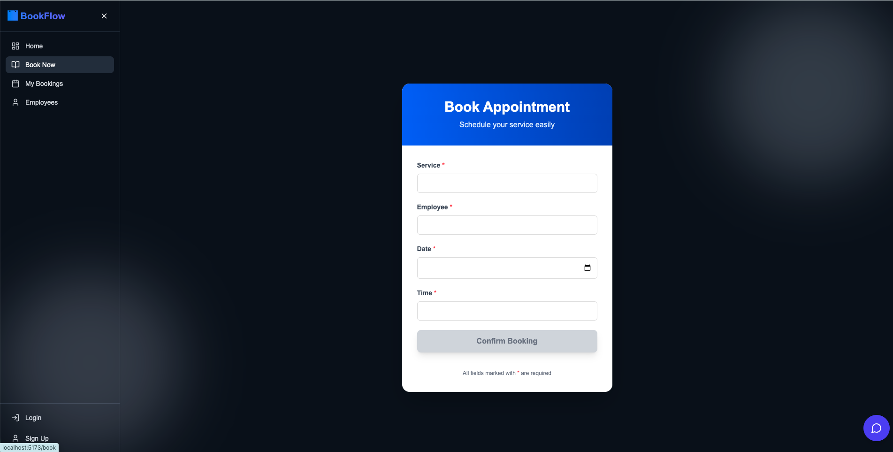
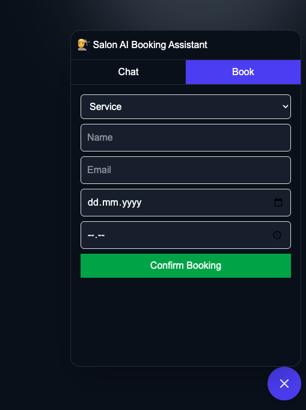
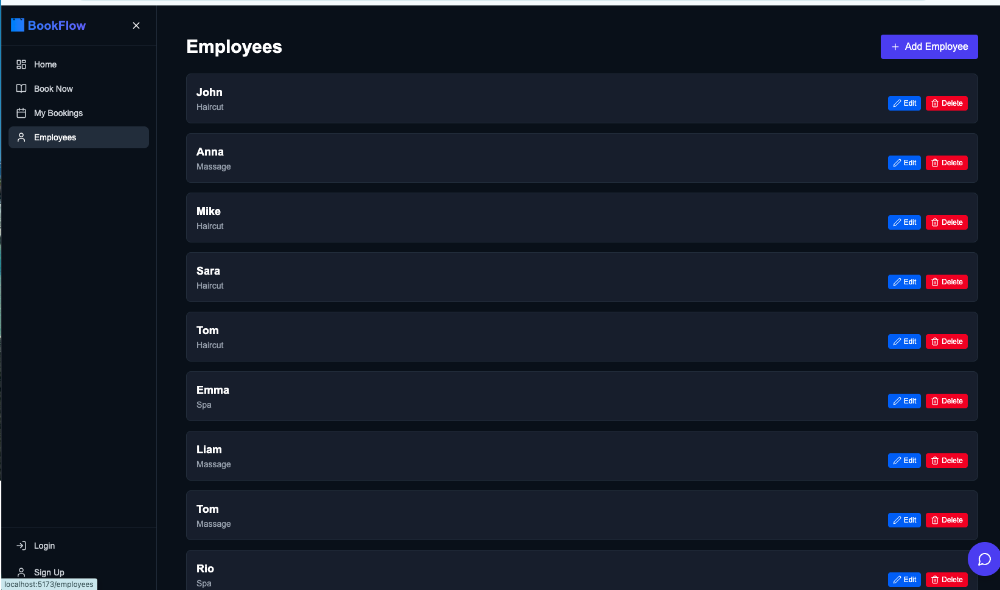

# 🤖 BookFlow AI – Intelligent Appointment Management Platform (SaaS Demo)

## 🌐 Live Demo

https://bookflowui.netlify.app/

---

# 📌 Overview

**BookFlow AI** is an AI-powered appointment management platform designed for salons, clinics, consultants, wellness centers, repair shops, and other service-based businesses.

The platform replaces manual booking methods such as phone calls, spreadsheets, and messaging apps with an intelligent scheduling system powered by automation and AI.

BookFlow AI helps businesses optimize appointments, improve customer experience, reduce no-shows, and make smarter business decisions through predictive insights.

---

# 🎯 Problem It Solves

Many service businesses still manage appointments manually, resulting in:

- Double bookings
- Missed appointments
- High cancellation rates
- Poor staff utilization
- Scheduling conflicts
- Long customer response times
- High administrative workload
- Limited business insights

---

# 💡 AI-Powered Solution

BookFlow AI centralizes the entire appointment workflow into a modern SaaS platform.

Businesses can:

- Book appointments online
- Manage services and employees
- Optimize staff schedules
- Track customers and appointment history
- View AI-powered business insights
- Reduce no-shows using predictive analytics
- Improve operational efficiency

---

# 🤖 AI Features

## 🧠 AI Booking Assistant

- Natural language booking
- Smart service recommendations
- Automatic employee suggestions
- AI-powered appointment scheduling

Example:

> "Book me a haircut next Tuesday after work."

BookFlow AI automatically recommends:

- Best employee
- Available time slot
- Estimated duration
- Expected waiting time

---

## 📅 Smart Scheduling

AI recommends appointment times based on:

- Employee workload
- Historical attendance
- Customer preferences
- Business peak hours
- Availability optimization

---

## 👨‍💼 AI Employee Recommendation

Employees are ranked using:

- Customer ratings
- Experience
- Service specialization
- Current workload
- Availability

---

## 🚫 No-Show Prediction

Every booking receives an AI attendance score.

AI analyzes:

- Previous booking history
- Cancellation patterns
- Appointment timing
- Customer behavior

Businesses receive recommendations before confirming appointments.

---

## 📈 AI Business Insights

BookFlow AI provides:

- Peak business hours
- Revenue trends
- Booking forecasts
- Employee utilization
- Customer retention insights
- Business health score

---

## 🎯 AI Customer Recommendations

Automatically recommends:

- Additional services
- Upsell opportunities
- Loyalty rewards
- Personalized promotions

---

# ⚙️ Core Features

## 👤 Customer Portal

- Browse services
- View pricing
- View service duration
- AI-assisted booking
- Select preferred employee
- Real-time availability
- Instant booking confirmation
- Manage bookings
- Cancel or reschedule appointments

---

## 📊 Admin Dashboard

- Appointment management
- Employee management
- Customer management
- Service management
- Business analytics
- Revenue dashboard
- Booking reports
- AI recommendations

---

## 👥 Employee Management

- Working schedules
- Availability
- Appointment history
- Performance overview
- Customer ratings

---

# 📊 Analytics Dashboard

Interactive dashboards include:

- Booking trends
- Revenue overview
- Employee performance
- Customer growth
- Service popularity
- Peak booking hours
- Cancellation analysis
- Business KPIs

---

# 🔐 Authentication & Roles

- JWT Authentication
- Secure Login
- Registration
- Password Encryption (Bcrypt)

### User Roles

- Administrator
- Employee
- Customer

---

# 📅 Booking Engine

- Real-time scheduling
- Double booking prevention
- Smart availability validation
- Appointment history
- Rescheduling
- Booking cancellation
- Booking status tracking
- Service duration management

---

# 🧠 Future AI Enhancements

- OpenAI Booking Assistant
- AI Voice Booking
- AI Chat Concierge
- AI Customer Sentiment Analysis
- Dynamic Pricing
- AI Revenue Forecasting
- AI Staff Scheduling
- AI Marketing Recommendations
- AI Customer Retention Prediction
- AI Review Analysis
- AI Business Health Dashboard

---

# 🧱 Tech Stack

## Frontend

- React (Vite)
- TypeScript
- React Router
- Tailwind CSS

## Backend

- Node.js
- Express.js
- Prisma ORM

## Database

- PostgreSQL

## Authentication

- JWT
- Bcrypt

## AI

- OpenAI API (planned)
- AI Recommendation Engine
- Predictive Analytics

## Deployment

Frontend

- Netlify

Backend

- Railway / Render

Database

- Supabase PostgreSQL

---

# 🏗 Architecture

React + TypeScript

↓

REST API (Express.js)

↓

Business Logic Layer

↓

AI Recommendation Engine

↓

PostgreSQL Database

↓

Notification Service

↓

Future Integrations

- Google Calendar
- Outlook Calendar
- Stripe
- OpenAI

---

# 📊 Business Value

BookFlow AI helps businesses:

- Reduce scheduling conflicts
- Improve customer satisfaction
- Lower no-show rates
- Increase staff productivity
- Save administrative time
- Improve operational efficiency
- Generate business insights using AI
- Increase revenue through intelligent scheduling

---

# 📱 Screens Included

- Landing Page
- AI Booking Assistant
- Appointment Booking
- Booking Confirmation
- My Bookings
- Dashboard
- Customer Management
- Employee Management
- Service Management
- AI Analytics Dashboard
- Mobile Responsive UI

---

# 🚀 Future Roadmap

- Stripe Payments
- Google Calendar Integration
- Outlook Calendar Sync
- Email Notifications
- SMS Reminders
- AI Voice Assistant
- AI Chatbot
- Team Collaboration
- Multi-location Support
- Customer Loyalty Program
- Subscription Plans
- AI Revenue Forecasting
- AI Marketing Campaigns

---

# 👨‍💻 Project Status

- ✅ AI-powered SaaS portfolio project
- ✅ Modern React + TypeScript architecture
- ✅ Production-ready frontend
- ✅ Backend-ready architecture
- ✅ Scalable SaaS foundation
- ✅ Ready for OpenAI integration

---

# 👤 Author

**Daniyal Tariq**

Web Applications Developer

**React • TypeScript • Node.js • PostgreSQL • AI-powered SaaS • UI Engineering**
